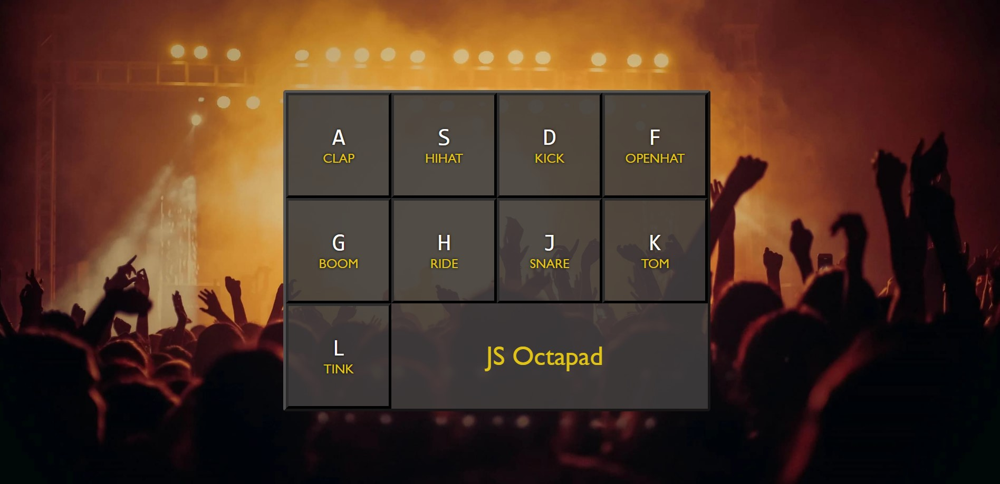

# 🥁 JavaScript - Octapad



Welcome to the JS Octapad project! This project aim was to build a fully operative Octapad just by using **HTML, CSS (developed using Sass), JavaScript and Gulp.**

An Octapad is an electronic percussion instrument which has eight rubber pads on a rectangular surface. These rubber pads produce sounds when they are struck on.

In this case, as we wanted to reproduce a complete drum kit we have added an extra pad. That means we have one more sound to be played to complete our drums.

## 🌐 Link to the App.

Should you wish to take a look to the deployed app, [feel free to visit it by clicking here] (https://yarapaz.github.io/js-drum-kit/).

## 🗂️ Content

1. [Project Structure](#-project-structure)
2. [Process](#️-process)
   1. [Front-end](#-front-end)
3. [How to run the Apps](#-how-to-run-the-apps)
   1. [Pre-requeriments](#pre-requeriments)
4. [Author](#-author)

---

## 🧱 Project structure

```
/
|
|– client
|   |– src
|     |– html
|     |– images
|     |– javascript
|     |– stylesheets
|     |– sounds
```

## ⚒️ Process

### ⭐ Front-end

---

```
/
|
|– client
|   |– docs
|   |– public
|   |– src
|     |– html
|       |– partials
|         |– main.html
|       |– index.html
|     |– images
|     |– stylesheets
|       |-core
|       |–layout
|     |– sounds
```

### ✳️ SASS

I have used SASS to organise the project styles in a clear and concise way.

## 🚀 How to run the Apps.

### Pre-requeriments

To start using this project clone this repo to a new directory.

> ```console
>  $ git clone https://github.com/yarapaz/js-drum-kit.git
> ```

### ➡️ Node

---

You have to go to server and run npm install in order to install the necesary dependencies.

> ```console
> $ npm install
> ```

Once you have installed the dependencies, you are ready to run the app with `npm start`.

> ```console
> $ npm start
> ```

> 👉 Open http://localhost:3000 to view the app in the browser

Once inside you will see the Octapad on full screen. In order to play it you just need to press the keys showed on the Octapad's pads on your keyboard to hear the sound playing a little animation appear to check you pressed that key.

Enjoy and have fun!


## 👩‍💻 Author

This App has been developed by [**Yara Paz**](https://github.com/yarapaz).
